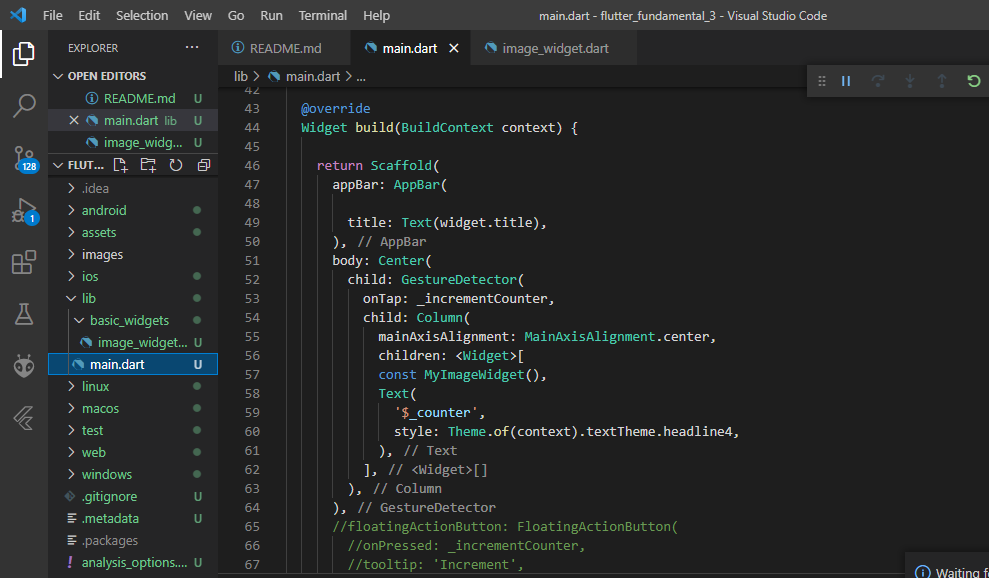

# Praktikum 1: Menerapkan Gesture Detector

## Langkah 1: Buat Project Baru

Buatlah sebuah project flutter baru dengan nama flutter_fundamental_3. Lalu jadikan repository di GitHub Anda dengan nama flutter-fundamental-part3.

## Langkah 2: Menambahkan GestureDetector

Buka file main.dart lalu ganti bagian body dengan kode berikut. Untuk MyImageWidget() dapat Anda ganti dengan widget milik Anda sendiri.

## Langkah 3: Buat Dokumentasi atau Laporan Praktikum

Simpan lalu coba untuk Run project Anda. Untuk kode MyImageWidget() di sini menampilkan logo Polinema seperti gambar berikut. Jika Anda coba klik/tap pada gambar, maka angka di bawah akan terus bertambah. Mengapa demikian? Jelaskan dalam laporan README.md! Jangan lupa kode dan hasil tampilannya di screenshot.

## Langkah 4: Eksperimen Jenis Gesture Lain

Sekarang Anda ganti kode bagian onTap dari Langkah 2 dengan onDoubleTap dan onLongPress. Lalu screenshot masing-masing hasil tampilannya dan jelaskan fungsinya!